# The Road Risk Panel — What Exists, and What It Is For

*A single-file account of the whole system: the problem, the flow, what is built,
what is not, and an explicit brief for drawing it as one figure.*

Status as of **2026-08-27**. Sources for every claim here: [`STEPS.md`](STEPS.md) (the
plan), [`IMPLEMENTED.md`](IMPLEMENTED.md) (the build log), [`README.md`](README.md) (the
user-facing description).

**What changed since the last revision of this file (2026-08-19).** Stage 3 closed —
registry weights enter as priors, a Leroux spatial field is fitted and reported, and every
run is validated out of sample by default. Stage 4 closed — the report and its
non-disableable limitations page exist, as one React component that is both the screen and
the PDF. Stage 5 is most of the way through: runs are stored in Postgres, served over
HTTP, and there is now a website over it. **The critical path has not moved**: every
corridor run to date still uses synthetic crashes.

---

## Contents

1. [In one paragraph](#1-in-one-paragraph)
2. [The problem this exists to solve](#2-the-problem-this-exists-to-solve)
3. [The whole flow, in twelve steps](#3-the-whole-flow-in-twelve-steps)
4. [Where the data comes from — the four tiers](#4-where-the-data-comes-from--the-four-tiers)
5. [The three ladders](#5-the-three-ladders)
6. [The honesty layer — rules enforced as code](#6-the-honesty-layer--rules-enforced-as-code)
7. [Where we are, stage by stage](#7-where-we-are-stage-by-stage)
8. [Evidence — what has actually been run](#8-evidence--what-has-actually-been-run)
9. [What is not built, and the critical path](#9-what-is-not-built-and-the-critical-path)
10. [Illustration brief — the figure to draw](#10-illustration-brief--the-figure-to-draw)

---

## 1. In one paragraph

Give the tool a road and a police crash table. It draws the corridor, cuts it into
segments, builds an empty panel from the **geography** rather than from the crashes,
fills that panel from free open data, checks whether the data can support a fitted
statistical model, chooses its own mode accordingly, fits or scores, checks its own
answers for contradictions, and returns a ranked list of dangerous segments where every
number can be traced to a named source. It writes that up as a report whose limitations
page is assembled from what the run actually did and which no setting removes, keeps the
run so it re-renders years later without a refit, and serves the whole thing over HTTP and
on a website. The model is the easy part. The product is the **path** from *a road, a crash
table and open data* to *a defensible ranked assessment* — in places that have no AADT, no
road inventory and no survey budget.

---

## 2. The problem this exists to solve

**The established tools assume data that most of the world does not have.**
iRAP-style assessment requires a survey vehicle to drive the corridor and code it —
roughly 50–200 USD per kilometre. The AASHTO Highway Safety Manual's predictive method
requires AADT, a road inventory, and a calibration dataset. Both are excellent, and both
are unavailable on the roads where the death rate is highest.

**Three consequences follow, and they define the whole design.**

| The gap | What we do instead |
|---|---|
| No survey vehicle | Free maps, free satellite rasters, free street-level imagery. Tier A and Tier B replace the van. |
| No AADT | A graph-centrality **traffic proxy**, never called AADT, never dressed as a volume. |
| No inventory | The registry declares 22 factors; adapters fill what open data can support and **report by name** everything it cannot. |

**And one failure mode dominates the field.** A count model built only on the rows where
crashes happened cannot estimate a rate — it can only redescribe the crash table. It will
still produce confident-looking coefficients. Preventing that specific misuse, loudly and
without an override, is the single most load-bearing rule in the codebase.

---

## 3. The whole flow, in twelve steps

```
coords → route → segment → panel skeleton → adapter fan-out → fuse
       → snap crashes → validate → mode select → fit/score
       → sign guard → rank → report
```

| # | Step | What happens | State |
|---|---|---|---|
| 1 | **Resolve the corridor** | Fetch by road `ref` from OSM (never by routing — a router returns the *fastest* path and silently leaves the road you asked about). Stitch fragments, bridge gaps, detect divided carriageways, project to UTM, build a linear reference: chainage 0 → N km. | **Built** |
| 2 | **Segment** | Cut into fixed-length units. Chainage continuous and exhaustive, no gaps, no overlaps, trailing runt merged. | **Built** |
| 3 | **Build the panel skeleton** | Cross `unit_id × period × time_slot`. `n_crashes` initialised to **0** everywhere. *This is where zero-crash rows are born — from geography, never from the crash table.* | **Built** |
| 4 | **Fan out the adapters** | One Overpass call along the corridor, two cloud-optimised raster windows, pure geometry, plus optional Tier B compute. Each adapter returns value + source + tier + licence. | **Built** (12 Tier A, 2 Tier B) |
| 5 | **Fuse and score agreement** | One value per factor per unit; the registry's ordered adapter chain decides the winner. Where two sources overlap, score agreement. Emit a **confidence tier per factor per unit**. | **Built** |
| 6 | **Snap the crashes** | Project each crash to the centreline within tolerance; chainage → `unit_id`, timestamp → `period` + `time_slot`. Every drop counted **with a reason**. | **Built** |
| 7 | **Validation gates** | Nine checks before anything is fitted: required columns, **zero-crash rows present**, exposure positive, crashes-per-parameter, temporal resolution, snap rate, VIF, variance-to-mean, convergence. Each returns HARD / SOFT / INFO. | **Built** |
| 8 | **Choose the mode — automatically** | Walk the ladder `A-full → A-reduced → A-minimal → B`, take the highest rung that passes every check. **The user has no override.** Every descent names the failed check and the dropped terms. | **Built** |
| 9 | **Fit or score** | Mode A: NB2 GLM with `ln(exposure)` offset, panel-clustered standard errors, optionally a Bayesian random-intercept GLMM. Mode B: crash-type-decomposed weighted index from cited weights — **ranked score only, never a count**. | **Built** |
| 10 | **Sign guard and diagnostics** | Every coefficient checked against its declared `expected_sign`. On contradiction, auto-run four confounding diagnostics plus a **spline** that hunts the U-shape none of the other four can see. | **Built** |
| 11 | **Validate out-of-sample** | Spatial cross-validation over contiguous stretches, CURE plots read against a measured design effect, calibration on held-out units — reported by default, including when bad. | **Built** |
| 12 | **Rank and export** | Rank units, aggregate into blackspots, render an HTML report carrying method, mode, every factor with source/tier/licence/confidence, dropped terms, and a limitations page that cannot be disabled. The PDF is that page printed, not a second document. | **Built** |

**And then, optionally, three more.** They add reach, not credibility, and the sequencing
rule in [`STEPS.md`](STEPS.md) says so plainly:

| # | Step | What happens | State |
|---|---|---|---|
| 13 | **Keep the run** | The whole payload into Postgres as `jsonb`, scoped to a tenant from the first migration, artefacts by reference. A stored run re-renders months later **without a refit**. | **Built** (5.1b) |
| 14 | **Serve it** | `POST /jobs` → `202`, a runner behind it, `GET /runs/{id}`. A refusal is a result: a broken panel is a `422` naming the column, a Mode B descent is a `200` carrying its receipts, and infrastructure failing is a job status with a cause. | **Built** (5.1c–d) |
| 15 | **A website over it** | Projects, corridors, jobs, runs, the registry — and the report itself as one of the screens, the same component the emailed file is built from. | **Built** (5.3a–b) |

**The two things that make it work, stated plainly:**

1. **The panel is built from geography, not from crashes.** Zero rows are structural, not
   optional. This is what makes a *rate* estimable rather than a *description*.
2. **Every value carries its source all the way to the report.** Nothing in the output is
   untraceable.

---

## 4. Where the data comes from — the four tiers

The whole product rests on one question per factor: **who pays to obtain it?**

| Tier | Meaning | Cost | Provided by | Built? |
|---|---|---|---|---|
| **A** | Open, global, no key, pure script | Free | Us, automatically | **12 factors live** |
| **B** | Open, but needs vision models or graph compute | Compute time | Us, with real work | **2 of 4 live** |
| **C** | Free-tier APIs, licence-limited | Free → paid | Us, opt-in only | Slots declared, none wired |
| **D** | Cannot be derived, must be measured | Client's cost | Customer | **Client adapter live** |

**Tier B is the moat.** It is what replaces the survey vehicle.

### What resolves today

| Source | Cost per corridor | Factors |
|---|---|---|
| Centreline geometry | arithmetic | `curve_radius_min`, `curve_density` |
| OpenStreetMap — one Overpass call | one request | `speed_limit`, `lanes`, `lit`, `surface_paved`, `sidewalk_present`, `median_present`, `junction_density`, `access_density`, `ramp_density`, `poi_density`, `building_density` |
| Copernicus DEM GLO-30, ESA WorldCover | COG window reads over HTTPS | `grade_pct`, `landuse_urban` |
| OSM graph centrality, Mapillary detections *(Tier B)* | shortest paths, a free token | `traffic_proxy`, `roadside_object_density` |
| Whatever the client measured *(Tier D)* | client's | any factor — enters as the **first** link in every chain |

**22 factors are declared in the registry. 17 have adapters. On a real corridor 11–12
typically resolve** — the rest are refused on coverage and reported by name with the
coverage that failed.

**Caching is by geography, not by corridor.** The strategic-network query is built from a
half-degree grid cell, so two different roads through the same county produce a
byte-identical query. Measured on two real Cyprus roads: **55.5 s cold, 1.2 s for the next
corridor in the same region.**

---

## 5. The three ladders

The same shape recurs at three levels: *try the best thing, test it honestly, descend when
it fails, and print a receipt.* This repetition is deliberate and it is the system's
signature.

### 5.1 The mode ladder — what the data can support

| Rung | Requires | Fits | Output |
|---|---|---|---|
| **A-full** | ≥ 700 crashes | up to 7 factors + offset | coefficients, intervals |
| **A-reduced** | ≥ 400 crashes | up to 5 factors | coefficients, intervals |
| **A-minimal** | ≥ 100 crashes | up to 3 factors | coefficients, wide intervals |
| **B** | cited weights only | none — scores | **ranked index, never a count** |

**The engine picks. The user cannot.** There is no "use Mode A anyway" flag and no
parameter that creates one. Mode B's result type has **no field** capable of holding a
predicted count — the constraint is structural, not conventional.

Terms are shed **by registry priority**, never by whichever happened to be significant.

### 5.2 The model stack — how the numbers are arrived at

| Rung | Model | State |
|---|---|---|
| 0 | Poisson GLM | **Built** — reference only, never in the client report |
| 1 | Negative Binomial (NB2) GLM | **Built** — the shipped default |
| 2 | Panel-clustered standard errors | **Built** — intervals up to **3.86× wider**; two factors lose significance |
| 3 | GAM spline on geometry | **Built** — a diagnostic that ships *no number*, by type |
| 4 | Bayesian hierarchical NB, random intercept per segment | **Built** — credible intervals, σ_u estimated |
| 4+ | Registry weights as priors | **Built** — the cited weights *are* the prior means, and each factor reports the share of its answer the prior accounts for |
| 4+ | Spatial Leroux CAR field | **Built** — ρ with a credible interval, and a corridor that cannot tell is told so |

**Why rung 2 matters more here than in most panels.** Every factor is *unit-constant* —
curvature, gradient, lane count, every density is a property of a segment, repeated
unchanged down every period. A 120-unit corridor over 24 months has **5,760 rows and 120
independent observations** of each covariate. Rung 1 computes its intervals as though it
had 5,760. Measured against planted truth across 60 synthetic panels: rung 1's 95%
intervals contained the true value **70%** of the time; rung 2's contained it **95%**.

**Rung 4 replaces p-values with credible intervals.** A p-value answers "how surprising
would this data be if the effect were exactly zero", which is nobody's question. A
credible interval answers "where is the effect, given this data". The Bayesian result type
carries **no p-value field at all**, and a test enumerates the forbidden names.

### 5.3 The inference ladder — inside rung 4

Built in **pure Python**: no compiler, no MCMC toolchain. The segment effects are
integrated out by Gauss-Hermite quadrature — one independent 1-D integral per unit — which
reduces a 130-dimensional problem to about ten parameters. That remainder gets a Laplace
approximation, and the importance weights that correct it **are also the honesty meter**.

| Attempt | Check | Outcome |
|---|---|---|
| Laplace + importance sampling | Pareto k̂ ≤ 0.7 **and** ≥ 400 effective draws | 3 factors → ~4 s · A-reduced, 5 factors → ~12 s |
| MCMC | convergence diagnostics | A-full, 8 factors → Laplace refuses, MCMC takes minutes |
| Refuse | — | rather than report an interval it cannot vouch for |

Neither threshold is negotiable to make a fit pass. `--bayes` chooses **how** the numbers
are arrived at, **never** which mode or rung the engine picks — a test asserts the same
panel returns the same mode, rung and factor list either way.

### 5.4 What closed Stage 3 — priors and the spatial field

**The two modes stopped being two systems.** *Mode B's cited weights **are** priors; Mode A
is those priors updated by data.* `--priors` puts the registry's weight for a factor in as
the prior mean, and the run reports the **share of each answer the prior accounts for** —
34% on a 691-crash corridor, 11% on a 5,782-crash one. That number is the point: it says
when you are reading the literature and when you are reading the road, per factor, rather
than leaving it to be assumed.

`expected_sign` enters as a *soft* prior and never as a truncation. Truncating a
coefficient to its expected sign would make the sign guard structurally incapable of ever
firing again — the one diagnostic whose whole job is to notice when the road disagrees with
the literature.

**Neighbouring segments are not independent, and now that is testable.** `--spatial` fits a
Leroux CAR field over the corridor chain by joint Laplace — a corridor is a chain, so the
precision matrix is tridiagonal and the integral stays cheap. It reports ρ with a credible
interval, and on a corridor too short to tell it says exactly that instead of a number.

---

## 6. The honesty layer — rules enforced as code

These are product decisions implemented as code rather than documented as intentions.
They run *across* the whole flow, not at one point in it.

| Rule | Where it bites |
|---|---|
| **No zero-crash rows, no Mode A.** | Gate check 1 — the single most load-bearing rule |
| **The engine picks the mode; the user cannot.** | No override exists anywhere in the API |
| **Mode B cannot produce a count.** | The result type has no field for one |
| **An uncited weight is refused.** | Absent from the index, never silently weighted zero |
| **A weight is a number plus the context it is valid in.** | Facility type, region, severity, crash scope all declared |
| **Where two sources disagree, both are reported.** | Never averaged. HSM prices grade at +0.12; iRAP at +0.49 — different questions, both printed |
| **A crash-type weight only moves its own crash type.** | Mode B decomposes by crash type and recombines with a cited distribution |
| **The same segment measured twelve times is not twelve observations.** | Clustered SEs, printed beside the naive ones with the ratio |
| **Below 20 units the correction is declined, not silently applied.** | The run says how wrong the uncorrected intervals are instead |
| **A contradicted sign is flagged, never quietly reported.** | Five diagnostics fire automatically; verdict states the term is not interpretable as causal |
| **An adapter cannot declare its own provenance.** | Tier and licence travel from the *registry*, not from the module |
| **A cache never makes a run look fresher than it is.** | Every hit reported with its fetch date; past a fortnight, an instruction to clear |
| **A derived quantity is refused when it is mostly a picture of the analysis window.** | The traffic proxy is tested against a symmetric parabola and withheld above 0.9 |
| **A number is never mapped onto a cited scale by assumption.** | Poles-per-km is *not* converted to the HSM 1–7 roadside hazard rating — that needs a study |
| **Client data outranks open data because the registry says so.** | Reordering the YAML reorders the outcome; no branch in the code prefers it |
| **Agreement is weaker evidence than disagreement.** | Open datasets copy from each other — agreement never *raises* confidence; disagreement lowers it and names the units |
| **A missing tag is not a zero.** | A factor needs half the corridor tagged to be emitted at all |
| **Nothing is silent.** | Every gate result, descent, dropped term and absent column enters the run log |
| **Every result is reproducible.** | The manifest fingerprints engine version, registry contents and input data |
| **A prior is never a truncation.** | `expected_sign` enters as a soft prior; truncating would make the sign guard incapable of firing |
| **Every run says how much of its answer came from the literature.** | Prior share, per factor — 34% on a thin corridor, 11% on a thick one |
| **A corridor that cannot tell is told so.** | The spatial ρ comes back wide, and the run says the corridor cannot resolve it |
| **The limitations page is data, not prose.** | Assembled from what the run did. No flag removes it, and a test tries every way to |
| **The PDF is the report printed, not a second document.** | One React component. There is no template kept in visual sync by hand |
| **A report renders from JSON alone.** | No engine object in scope, so a run stored months ago still renders |
| **A refusal is a result, not an HTTP error.** | 422 names the column and creates no job; a Mode B descent is a **200** carrying its receipts |
| **The mode is on every screen, because it is a layout element.** | A page is a child of its layout and cannot remove it — asserted, and fetched |
| **Every read is scoped to a tenant, with no default.** | The store interface makes the argument impossible to omit; the API makes the header required |

---

## 7. Where we are, stage by stage

| Stage | State | Detail |
|---|---|---|
| **0 — Foundations** | ✅ **Done** | Package layout, registry schema, input contract, transforms |
| **1 — Engine core** | ✅ **Done** | Registry, contract, 9 gates, mode ladder, both modes, sign guard, run log, CLI. Mode B scores from context-aware weights sourced from AASHTO HSM, the Elvik Power Model and iRAP |
| **2 — Geospatial pipeline** | 🟡 **Nearly done** | Corridor from OSM, linear referencing, segmentation, panel skeleton, crash snapping, 12 Tier A + 2 Tier B factors behind one adapter contract, fusion with per-unit confidence, geographic cache. **Outstanding:** vision-model inference, DEM viewshed, PostGIS geometry persistence |
| **3 — Model depth** | ✅ **Done** | Panel-clustered SEs, GAM spline diagnostic, Bayesian random-intercept GLMM with credible intervals, registry weights as priors with a reported prior share, a Leroux spatial field, and out-of-sample validation reported by default |
| **4 — Report and PDF** | ✅ **Done** | One React component rendered from `run.json` alone: mode banner, ranking, factors with source/tier/licence/confidence, receipts, SVG figures with no external request, and a limitations page assembled from the run that no flag removes. The PDF is that page printed |
| **5 — Web layer** | 🟡 **Mostly done** | Layering rule as a test (5.0), payload contract frozen and TypeScript generated from it (5.1a), Postgres storage tenant-scoped from the first migration (5.1b), FastAPI with the refusal contract enforced by exception handler (5.1c), an in-process runner (5.1d), adapters fanning out as independently-failable branches (5.2a, part one), the report as an importable library (5.3a), a Next.js shell whose banner no route can omit (5.3b), and a map where clicking a segment gives the provenance of every number on it — with no basemap and no external request unless one is configured (5.3c). **Outstanding:** Celery (5.2a), cost model and cap (5.2b), per-tenant secrets (5.2c), the interactive layer (5.3d), auth and row-level policies (5.4) |
| **6 — Deploy** | ⬜ **Not started** | Containers, hosting |

**905 tests pass, 36 skipped. `ruff check` clean.**

`core/` never imports the layers above it — and since 5.0 that is a test rather than a
docstring, checked by parsing the source with `ast` because half the package sits behind
optional extras the suite never installs. It is why the geospatial dependencies are an
optional extra rather than a hard requirement, why GDAL — needed by exactly two adapters —
sits behind its own, and why `pip install roadrisk-panel` still needs neither a database,
a web server nor a JavaScript toolchain.

---

## 8. Evidence — what has actually been run

### Two real corridors, deliberately unalike

| | **Cyprus B9** (Troodos) | **Dutch N201** (polder) |
|---|---|---|
| Date | 2026-08-10 | 2026-08-17 |
| Character | windy, mountainous | flat, polder into Amsterdam |
| Input | 69 OSM fragments | 810 vertices |
| Centreline | 25.01 km | 33.50 km |
| Units | 50 | 67 |
| Panel rows | 1,200 | 1,608 |
| Crash snap rate | 99.8% | 84.3% |
| Factors resolved | 12 of 14 attempted | 11 of 13 |
| Mode reached | A | A |

The second corridor was **chosen by measurement, not off a map**: `access_density` and
`ramp_density` had to *separate*, and on N201 they do, at VIF 1.00 / 1.00 — 18 units carry
an access and no ramp, 15 carry a ramp and no access. On B9 they cannot: one unit of fifty
has a ramp anywhere near it.

**The crash data for both roads is synthetic.** What these runs validate is the geometry
and adapter path, not any road. This is stated three times in the run output. See §9.

### Measured, not asserted

| Claim | Measurement |
|---|---|
| Clustered intervals are honest | 60 planted panels: naive 70% coverage → clustered **95%** |
| The correction is visible | `access_density` p < 0.0001 → **0.65**; interval **3.86×** wider |
| The cache pays for itself | B9 cold **55.5 s** → E601 same region **1.2 s** |
| The traffic proxy is unstable under its own window | 5/10/20 km margins move the peak unit from 1 → 26 → 19; **reported, and the reason the factor stays uncited** |
| The Bayesian rung is fast enough | A-reduced, 5 factors → **~12 s** in pure Python |
| The spline does not invent bends | A turn must survive resampling by unit — *"the same shape came back on 40 of 40 corridors"* |
| Out-of-sample calibration holds | Spatial CV over contiguous stretches: observed **2,803** vs predicted **2,756**, ratio **1.02** |
| A CURE plot needs its design effect measured | At realistic per-unit heterogeneity, **16–60%** of the curve falls outside naive bounds — *all of it spurious*. Read against the wrong band, every honest model looks broken |
| The prior share is a real number, not a gesture | Same factor, two corridors: **34%** of the answer from the literature on 691 crashes, **11%** on 5,782 |
| The spatial field admits ignorance | Planted ρ = 0.9: **0.89 [0.73, 0.98]** on 80 units; **0.44 [0.05, 0.86]** on 40 — reported as *this corridor cannot tell* |
| The screen and the emailed file are one document | The same run through both entry points: `article.report` **49,929 characters, identical hash** |
| The banner is on every screen, not most | 11 of 11 routes fetched and checked; **11 of 11 fail** when it is taken out of the layout |
| A website did not disturb the product | After the workspace move, `report.html` rebuilt **byte-identical** |

### Defects the real data exposed, and what they cost

Recorded because they are the argument for validating on real roads at all:

- The default resample interval was set by guesswork.
- A test fixture was manufacturing the signal it tested for.
- Corridor contraction was contracting nothing.
- A 92%-tagged factor was being thrown away.
- The first spline **invented a bend** on a panel whose effect was planted linear — the
  worst failure that module could have, because its answer is the one that stops people
  looking. Fixed by reporting only the shape the whole penalty grid agrees on.
- Mapillary took five defects to get working, and **two of them were in the factor's own
  definition**: signage was 54% of the count and is not a struck-object hazard, and a 50 m
  radius was measuring the neighbourhood rather than the verge.

**And two the later stages exposed, both about descriptions drifting apart:**

- `posterior.coefficients` is a mapping, and the hand-written TypeScript had it typed as a
  list. Every coefficient fell back silently to its frequentist interval under a *credible
  interval* heading, and it survived three steps. That defect is the entire argument for
  5.1a: there is now **one** description of the payload, in Python, and the TypeScript is
  projected from it — as is the API envelope the website reads, for the same reason.
- `.gitignore` has carried `runs/` since Stage 0 for output directories. It matches a
  folder of that name at any depth, and it was quietly swallowing `web/shell/app/runs/` —
  the layout carrying the mode banner. Everything built, every test passed, and the files
  would not have been in the commit. Caught by reading `git status`, which is not a
  mechanism, so there is now a test that asks git what it is hiding.

---

## 9. What is not built, and the critical path

### 🔴 The critical path — one item

> **A real police crash extract.** Every corridor run so far uses synthetic crashes, which
> validate the geometry and the adapter path and **nothing about any road**. A single real
> extract is worth more than a third corridor.

### Ordered, after that

| # | Item | Why it is not built |
|---|---|---|
| 1 | **A third region, and primary *and* secondary roads** | The call topic asks for at least three regions with region-level comparison. Two corridors exist, both on synthetic crashes — which is the item above wearing a different hat |
| 2 | **Hazard layers — flood, fire, storm, snow** (unstaged) | The cheapest quarter of the call topic available anywhere: the adapter contract and raster windowing already fit them exactly, and JRC river flood maps, EFFIS and ERA5 are free. **The highest-value unbuilt work in this repository after real crash data** |
| 3 | **Celery** (5.2a, part two) | Adapters fan out today, but across threads in one process. Nothing survives a deploy and there is no retry. The decision to make first is whether to fan out over *branches* (both already JSON-shaped) or over *fetches* through a shared cache — which needs object storage at 6.2 |
| 4 | **Cost model and spend cap** (5.2b) | Nothing counts spend anywhere. The only cost figure in the repository is the 50–150 USD per corridor recorded against the unbuilt `mapillary_vision`. A cap has to refuse *before* the call, and its refusal is a receipt like any other |
| 5 | **The interactive layer** (5.3d) | The hover and detail layer step 4.4 deferred as screen-only. The map at 5.3c is built and answers *why is this segment dark*; what is left is the same for a reader who never opens it |
| 6 | **Auth and row-level policies** (5.4a) | `X-Tenant-Id` scopes every read and proves nothing. The storage seam was built for this from the first migration; what is missing is identity and a database that refuses a cross-tenant read on its own |
| 7 | **`mapillary_vision`** | Our own inference on sampled frames. The main cost trap in the pipeline at 50–150 USD of VLM calls per corridor, **and** it needs the poles-to-RHR mapping study before its output means anything |
| 8 | **`dem_viewshed`** | `sight_distance_proxy` by marching the line of sight against terrain. Cheap to attempt; crude by nature — a DEM sees terrain but not vegetation, walls or parked vehicles |
| 9 | **`population_density`** | The one Tier A factor with no working adapter, blocked on *delivery format* not data: WorldPop ignores HTTP `Range` headers and streams the whole file; GHSL ships deflated zip tiles that cannot be windowed |
| 10 | **PostGIS geometry, containers, hosting** | Runs are in Postgres as `jsonb`; *geometry* is not, and nothing yet needs a spatial index. Deploy is Stage 6 |

### Environment constraints worth knowing

PyMC installs but **cannot sample** on the original development machine: no C++ compiler,
so PyTensor falls back to pure Python, and Windows Smart App Control refuses the unsigned
native DLLs that Numba, `nutpie` and JAX would need. Turning that policy off was declined —
it cannot be re-enabled without reinstalling Windows. **The requirement was met in pure
Python instead**, which is why the Bayesian rung integrates the segment effects out by
quadrature rather than sampling them, and why the spatial field is a joint Laplace over a
tridiagonal precision matrix.

**Development moved to WSL2 / Ubuntu on 2026-08-24**, because the same policy blocks every
compiled Python wheel the project depends on — numpy, pandas, statsmodels, pydantic-core.
Nothing about the package changed; the interpreter simply has to live somewhere it is
allowed to run. The JavaScript toolchain moved with it, and rebuilding the report bundle in
WSL produced a file byte-identical to the one built on Windows.

### Open decisions that need a human, not a code change

1. **A licensed AASHTO HSM.** Equations were read from the NCHRP draft of the 2nd edition
   and are double-checked against published worked examples by a test, but HSM2 (2024)
   changed Parts C and D. One afternoon with the book closes it.
2. **Measure operating speed on one corridor.** `speed_limit` carries a permanent caveat
   because the Elvik exponent applies to *operating* speed, not posted limit. One Tier C
   speed pull removes the largest known weakness in the index.
3. **Supply a local crash-type distribution.** The default shares come from HSM Table 10-4
   — Washington State, rural two-lane, 2002–2006. Most national crash databases can
   produce a local split directly. One of the cheapest accuracy improvements available.
4. **Resolve `lanes`.** It is a volume proxy expecting `+` for total crashes, while iRAP
   prices lane count at `−` for head-on-overtaking crashes only. Two mechanisms in one
   column. The fix is separating the exposure role from the risk role, not picking a sign.

---

## 10. Illustration brief — the figure to draw

Everything below is written to be handed to an illustrator or an image model. Box labels
are given verbatim.

### 10.1 Figure 1 — the master flow

**Format:** landscape, left-to-right, five vertical bands, plus one full-width band along
the bottom. A0 or 16:9. A sixth, narrower band is described at the end — it is what the
system became after the analysis was finished, and it is deliberately drawn smaller.

**Colour key** — use it consistently and put the legend top-right:

| Colour | Meaning |
|---|---|
| **Solid fill, dark outline** | Built and validated |
| **Solid fill, dashed outline** | Partly built |
| **No fill, grey dashed outline** | Not started |
| **Red outline** | A refusal path — where the system stops rather than guesses |

**Band 1 — INPUTS** *(narrow, far left)*

- `Road reference + bounding box` — or a centreline CSV
- `Police crash table (lat, lon, timestamp)` ← mark this **"the one required input"**
- `Client inventory (optional)` ← mark **"Tier D — wins every factor it covers"**
- `Run context: facility type · region · severity`

**Band 2 — BUILD THE PANEL FROM GEOGRAPHY**

- `1. Resolve corridor` — sub-label: *fetch by road ref, stitch fragments, bridge gaps,
  detect divided carriageways*
- `2. Linear reference` — sub-label: *project to UTM, chainage 0 → N km*
- `3. Segment` — sub-label: *fixed-length units, no gaps, no overlaps*
- `4. Panel skeleton` — sub-label: **`unit_id × period × time_slot`, n_crashes = 0**

> ⭐ **Call-out box on step 4, prominent:**
> *"Zero-crash rows are born here — from the road, never from the crash table.
> This is what makes a rate estimable rather than a description."*

**Band 3 — FILL THE PANEL**

Draw as a **fan-out then a fan-in**.

Fan-out — four parallel adapter lanes, each labelled with its tier badge:

| Lane | Badge | Label |
|---|---|---|
| Geometry | **A** | `curvature — pure arithmetic` |
| OpenStreetMap | **A** | `one Overpass call → 11 factors` |
| Rasters | **A** | `Copernicus DEM + ESA WorldCover — COG windows` |
| Compute | **B** | `graph centrality · Mapillary detections` |
| Client | **D** | `whatever the client measured` |

Each lane carries a small tag: **`value + source + tier + licence`**.

Fan-in — one box:

- `5. Fuse` — sub-label: *registry chain decides the winner; agreement scored; **confidence
  tier per factor per unit***

Then, joining from below:

- `6. Snap crashes to units` — sub-label: *every drop counted, with a reason*

> **Call-out on the fan-in:**
> *"An adapter cannot declare its own provenance — tier and licence travel from the
> registry. Client data wins because the registry says so, not because the code does."*

Add a small **cache** icon feeding the OSM and raster lanes, labelled
**`55.5 s cold → 1.2 s for the next corridor in the same region`**.

**Band 4 — DECIDE, THEN FIT**

This is the heart of the figure. Give it the most space.

- `7. Nine validation gates` — list them small: *columns · **zero-crash rows** · exposure ·
  crashes-per-parameter · temporal resolution · snap rate · VIF · variance-to-mean ·
  convergence.* Each returns HARD / SOFT / INFO.

Then draw the **mode ladder as an actual descending staircase**, top-left to
bottom-right, with a red side-arrow off each step labelled with the failed check:

```
A-full      ≥700 crashes · 7 factors  ─┐
   A-reduced   ≥400 crashes · 5 factors  ─┐
      A-minimal   ≥100 crashes · 3 factors  ─┐
         MODE B      cited weights · ranked score, NO COUNT
```

> ⭐ **Call-out beside the staircase, the largest in the figure:**
> *"The engine picks the mode. The user cannot. There is no 'use Mode A anyway' flag,
> and Mode B's result type has no field to put a count in."*

Then two outcome boxes side by side:

- **MODE A — FITTED** → `NB2 GLM + ln(exposure) offset` → `panel-clustered SE` →
  optional `Bayesian GLMM — credible intervals, σ_u`
  *Annotate the clustering arrow:* **`intervals up to 3.86× wider — two factors lose
  significance`**
- **MODE B — SCORED** → `crash-type-decomposed weighted index from cited weights`
  *Annotate:* **`ranked score only — never a predicted count`**

Small linking arrow between them, dashed, labelled:
**`the target: Mode B weights are priors, Mode A is those priors updated by data (not
built)`**

**Band 5 — EXPLAIN, THEN DELIVER**

- `10. Sign guard` — sub-label: *every β against its declared `expected_sign`*
- On contradiction, a branch into five diagnostics: `factor alone` · `with each correlated
  partner` · `correlation matrix` · `leave-one-unit-out` · `GAM spline — hunts the U-shape`
  *Tag the spline:* **`ships no number, by type`**
- `11. Out-of-sample validation` — sub-label: *spatial CV over contiguous stretches · CURE
  against a **measured** design effect · calibration on held-out units*
- `12. Rank units → blackspots`
- `Report: one component` — tag it **`the screen and the PDF are the same document`**
- `Limitations page` — tagged **`assembled from the run · no flag removes it`**

**Band 6 — KEEP IT, SERVE IT, SHOW IT** *(optional; draw narrower than the others)*

Everything here **adds reach, not credibility**, and the figure should not let it look
like part of the analysis. A thin separating rule and a smaller type size say it best.

- `Store the run` — sub-label: *the whole payload as `jsonb`, tenant-scoped from the first
  migration.* Tag: **`re-renders months later without a refit`**
- `Serve it` — sub-label: *`POST /jobs` → 202 · a runner behind it.* Tag in **red outline**:
  **`a refusal is a result — 422 names the column, a Mode B descent is a 200`**
- `The website` — sub-label: *projects · corridors · jobs · runs · the report itself.*
  Tag: **`the same component the emailed file is built from`**
- `The map` — sub-label: *the corridor in Web Mercator, each segment in its risk colour,
  a click giving every number's source.* Tag: **`no basemap, no request — a tile source is
  opt-in and brings an attribution obligation with it`**
- Draw a small banner strip pinned across the top of the website box, labelled
  **`the mode banner is a layout element — no route can omit it`**

> **Call-out between `The map` and the report in band 5, drawn as a barrier rather than
> an arrow:** *"The screen's map is not the document's. The report draws its corridor as
> inline SVG so that no external image request exists anywhere in it — that is what lets
> a report be emailed. The two are deliberately not consolidated."*

**Bottom band — THE HONESTY LAYER** *(full width, spanning every band above, with small
upward ticks into each)*

Label it: **`Run log · provenance · reproducibility manifest · refusal receipts`**
and beneath: **`Nothing is silent. Degrade loudly.`**

Place five badges along it:

- `Every gate result, descent and dropped term is logged`
- `Every value carries source · tier · licence · confidence to the PDF`
- `Two identical runs fingerprint identically`
- `A cache never makes a run look fresher than it is`
- `Every run says how much of its answer came from the literature`

**Bottom-right corner — a status strip:**

`Stage 0 ✅ · Stage 1 ✅ · Stage 2 🟡 · Stage 3 ✅ · Stage 4 ✅ · Stage 5 🟡 · Stage 6 ⬜
— 905 tests passing`

**One more thing the figure must not flatter.** Wherever crashes enter the drawing, put a
small red-outlined tag on them: **`synthetic on every corridor run to date`**. It is the
single most important caveat in the system and the easiest one for a diagram to hide.

### 10.2 Figure 2 — the recurring shape *(optional inset)*

One small diagram, reused three times, showing that the same pattern governs three
different decisions. Draw once and label the three instances:

```
      try the best thing
              ↓
      test it honestly  ──✗──→  descend  ──→  print a receipt
              ↓ ✓
           report it                         (refuse if nothing passes)
```

| Instance | Best thing | The honest test | Floor |
|---|---|---|---|
| **Mode ladder** | A-full | nine gates | Mode B |
| **Model stack** | Bayesian GLMM | convergence | NB2 |
| **Inference ladder** | Laplace | Pareto k̂ ≤ 0.7, ≥400 draws | refuse |

### 10.3 Mermaid source

Renders directly in GitHub, Obsidian, or any Mermaid live editor — useful as a first pass
before the illustration.

```mermaid
flowchart LR
  subgraph IN["① INPUTS"]
    A1["Road ref + bbox<br/><i>or centreline CSV</i>"]
    A2["Police crash table<br/><b>the one required input</b><br/><i>synthetic on every run to date</i>"]
    A3["Client inventory<br/><i>Tier D, optional</i>"]
  end

  subgraph GEO["② BUILD THE PANEL FROM GEOGRAPHY"]
    B1["Resolve corridor<br/><i>by road ref, never by routing</i>"]
    B2["Linear reference<br/><i>UTM, chainage 0 to N km</i>"]
    B3["Segment<br/><i>fixed length, no gaps</i>"]
    B4["PANEL SKELETON<br/><b>unit x period x slot, crashes = 0</b>"]
    B1 --> B2 --> B3 --> B4
  end

  subgraph FILL["③ FILL THE PANEL"]
    C1["Geometry · Tier A"]
    C2["OpenStreetMap · Tier A<br/><i>one call, 11 factors</i>"]
    C3["DEM + WorldCover · Tier A"]
    C4["Graph + Mapillary · Tier B"]
    C5["Client data · Tier D"]
    C6["FUSE<br/><i>registry chain wins;<br/>confidence tier per unit</i>"]
    C7["Snap crashes<br/><i>every drop given a reason</i>"]
    C1 --> C6
    C2 --> C6
    C3 --> C6
    C4 --> C6
    C5 --> C6
    C6 --> C7
  end

  subgraph DECIDE["④ DECIDE, THEN FIT"]
    D1{"NINE GATES<br/><b>zero-crash rows?</b><br/>VIF · dispersion · snap rate"}
    D2["A-full · 700 crashes · 7 factors"]
    D3["A-reduced · 400 · 5"]
    D4["A-minimal · 100 · 3"]
    D5["MODE B<br/><b>ranked score, no count</b>"]
    D6["NB2 GLM + ln exposure offset"]
    D7["Panel-clustered SE<br/><i>up to 3.86x wider</i>"]
    D8["Bayesian GLMM<br/><i>credible intervals, sigma_u</i>"]
    D9["Registry weights as priors<br/><i>prior share reported per factor</i>"]
    D10["Leroux spatial field<br/><i>rho, or 'this corridor cannot tell'</i>"]
    D1 --> D2
    D2 -->|"fails"| D3
    D3 -->|"fails"| D4
    D4 -->|"fails"| D5
    D2 --> D6
    D3 --> D6
    D4 --> D6
    D6 --> D7 --> D8
    D8 -.-> D9
    D8 -.-> D10
  end

  subgraph OUT["⑤ EXPLAIN, THEN DELIVER"]
    E1["SIGN GUARD<br/><i>every beta vs expected_sign</i>"]
    E2["5 diagnostics<br/><i>incl. GAM spline — ships no number</i>"]
    E3["Out-of-sample validation<br/><i>spatial CV · CURE · calibration</i>"]
    E4["Rank units into blackspots"]
    E5["REPORT<br/><i>one component: the screen and the PDF</i>"]
    E6["Limitations page<br/><b>no flag removes it</b>"]
    E1 -->|"contradiction"| E2
    E1 --> E3 --> E4 --> E5 --> E6
  end

  subgraph WEB["⑥ KEEP IT, SERVE IT, SHOW IT — reach, not credibility"]
    F1["Store the run<br/><i>jsonb, tenant-scoped</i>"]
    F2["HTTP API<br/><b>a refusal is a result</b>"]
    F3["The website<br/><i>the same Report component</i>"]
    F4["The map<br/><i>no basemap, no request</i>"]
    F1 --> F2 --> F3 --> F4
  end

  A1 --> B1
  A2 --> C7
  A3 --> C5
  B4 --> C6
  C7 --> D1
  D5 --> E4
  D8 --> E1
  E6 --> F1

  LOG["<b>THE HONESTY LAYER</b> — run log · provenance · manifest · refusal receipts<br/><i>Nothing is silent. Degrade loudly.</i>"]
  GEO -.-> LOG
  FILL -.-> LOG
  DECIDE -.-> LOG
  OUT -.-> LOG
  WEB -.-> LOG
```



### 10.4 If only one sentence fits under the figure

> **The panel is built from the road, not from the crashes; the engine — not the user —
> decides what the data can support; and every number carries its source all the way to
> the PDF.**

---

## Appendix — the layout on disk

```
src/roadrisk/
├── contract/                one description of the payload — the bottom of the layer order
├── core/                    plain library — no web, no network, no database
│   ├── registry/            22 declarative factors (schema, loader, factors.yaml)
│   ├── contract.py          the six required columns; exposure derivation
│   ├── context.py           what kind of corridor, and what crashes were counted
│   ├── crashmix.py          how total crashes split by type; the cited default
│   ├── weights.py           weight selection and source-agreement scoring
│   ├── transforms.py        ln / ln1p / identity / zscore, each guarded
│   ├── diagnostics.py       VIF, correlation, dispersion
│   ├── gates.py             the nine validation checks
│   ├── ladder.py            A-full → A-reduced → A-minimal → B
│   ├── gam.py               the rung 3 spline
│   ├── models/              Poisson (reference), NB2 (shipped), Bayes, spatial, Mode B index
│   ├── signguard.py         expected_sign enforcement and follow-up diagnostics
│   ├── validation.py        spatial CV, CURE, calibration — reported even when bad
│   ├── runlog.py            append-only event log, reproducibility manifest
│   └── engine.py            the one entry point
├── geo/                     geography → panel. Optional extra; core never imports it
│   ├── crs.py               UTM projection — all geometry is metric, never degrees
│   ├── corridor.py          linear referencing and the structural gates
│   ├── segmentation.py      fixed-length units, continuity asserted not assumed
│   ├── panel.py             the skeleton — zero rows exist because road exists
│   ├── snapping.py          crashes onto the corridor, every drop given a reason
│   ├── geometry.py          curvature, computed from the centreline alone
│   ├── osm.py               fetch a corridor by road ref; stitch, bridge, gate
│   ├── adapters/            one factor, one source, one tier, one licence
│   ├── branches.py          adapters as independently-failable units, and the fan-out
│   ├── cache.py             remember fetches by geography, and report their age
│   └── pipeline.py          the orchestrator
├── report/                  the seam between a finished run and the page that shows it
│   ├── limitations.py       what this run cannot support, read off the run itself
│   ├── pdf.py               print the written report; the browser is a dependency of nothing
│   └── static/index.html    the built report — committed, so installing needs no Node
├── store/                   where runs live once the process that made them has gone
│   ├── base.py              the interface — every read takes a tenant, with no default
│   ├── memory.py            needs no server, and is not a toy — the suite runs on it
│   ├── postgres.py          plain SQL over psycopg3, no ORM
│   └── migrations/          numbered SQL, each recorded with the hash that produced it
├── api/                     the product over HTTP. Optional extra; nothing below imports it
│   ├── errors.py            the refusal contract — one envelope, three distinct outcomes
│   ├── runner.py            the work, the interface, and the seam Celery replaces
│   └── routes/              meta, registry, projects, corridors, jobs, runs
├── demo.py                  synthetic panels for tests and demonstration
├── storecli.py              `roadrisk store` — kept apart so `assess` never needs psycopg
└── cli.py                   mode banner, refusal receipt, descent receipt

web/                         one report, imported three times. Nothing else renders it
├── src/report/              the library — Report, sections, figures, styles, generated types
├── src/entries/             the file:// bundle, and mountReport() for a host page
└── shell/                   the website — routes, two layouts, and the banners in them
```

**The layering rule:** `core/` never imports the layers above it — `core → demo → geo →
report → api → worker → cli`, downhill only. Since 5.0 that is a test rather than a
docstring, and it has a fourth check for the loophole: `core` imports the package root for
its version string, so the day the root re-exports something from `geo`, importing the
engine imports shapely while every direct import still points downhill. It is why the
geospatial dependencies are an optional extra rather than a hard requirement, and why GDAL
— the heaviest thing this package can depend on, needed by exactly two adapters — sits
behind its own extra that the test suite never installs.

### Commands that demonstrate each claim

```bash
roadrisk demo                                   # end to end on a synthetic corridor
roadrisk demo --crash-rows-only                 # watch Mode A be refused
roadrisk demo --u-shape curve_density           # watch the sign guard and the spline
roadrisk demo --units 40 --periods 12 --bayes   # credible intervals instead of p-values
roadrisk corridor --demo --bayes --report out/  # coordinates to a readable report, one command
roadrisk registry                               # the 22 factors and their weight status
roadrisk serve --tenant                         # the API, and a tenant to use it with

python tools/validate_corridor.py               # the two real corridors
python tools/validate_coverage.py               # proves the clustered intervals honest
python tools/validate_posterior.py              # puts the two rungs side by side
python tools/generate_types.py --check          # the TypeScript still matches the Python
python tools/check_shell.py --tenant …          # every screen still carries the banner
```

```bash
cd web && npm ci && npm run build               # rebuild the committed report bundle
cd web/shell && npm run dev                     # the website, over a running API
```
